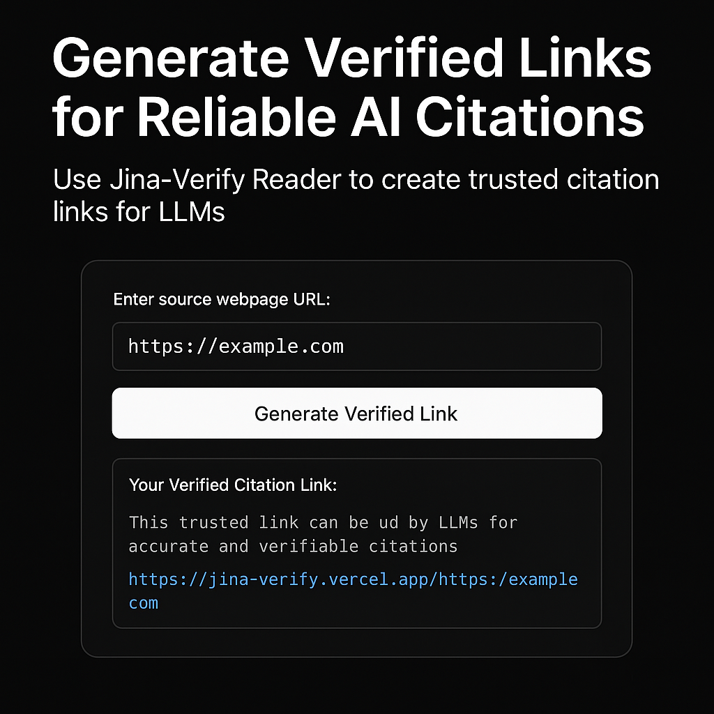
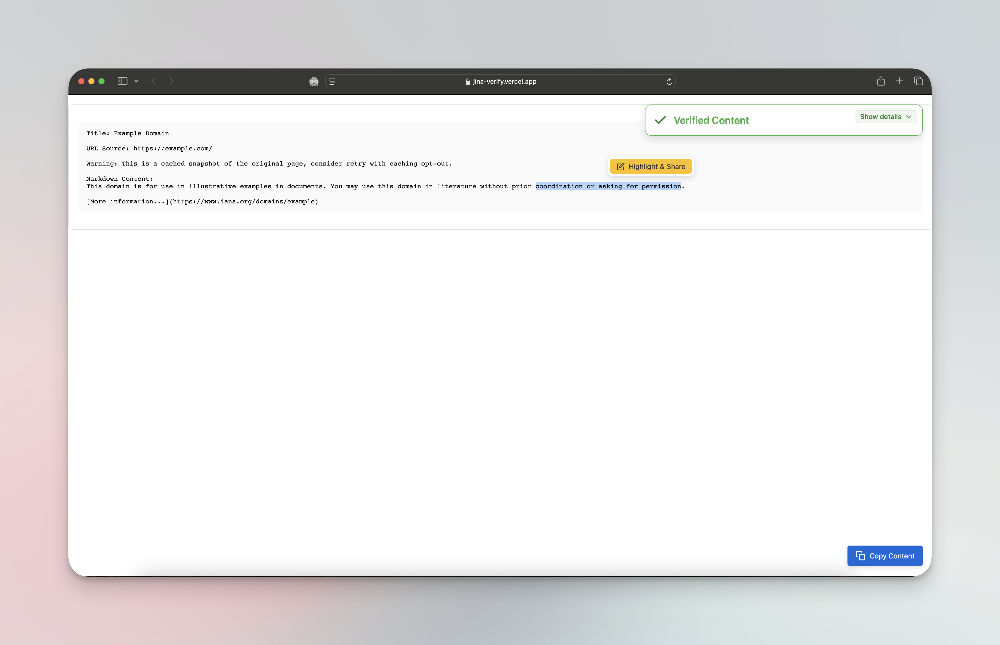
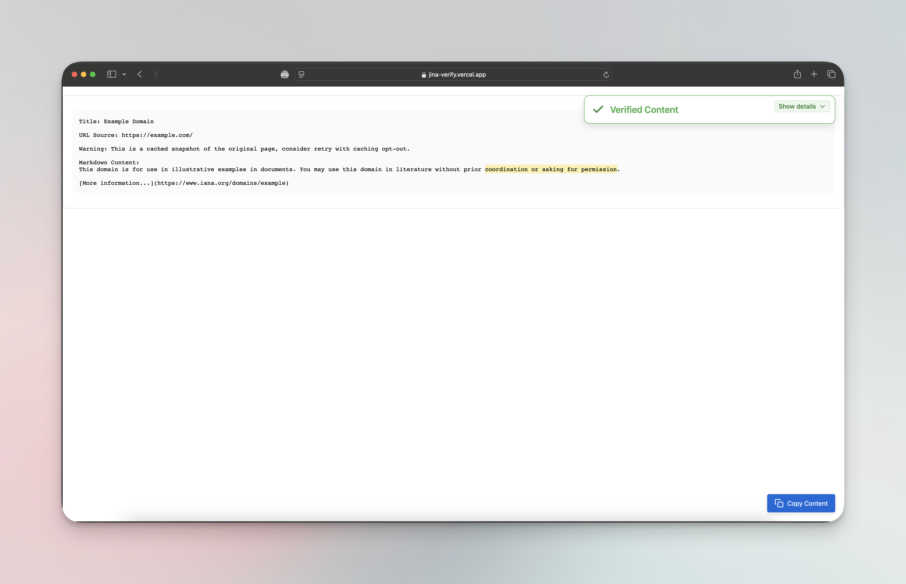

# Jina-Verify



## The Challenge of Reliable AI Citations

Large Language Models (LLMs) frequently generate information without proper source attribution, leading to hallucinations and unreliable outputs. When LLMs do provide citations, they often:

- Generate fake or non-existent URLs
- Cite sources that don't contain the referenced information
- Misrepresent source content or quote incorrectly

This creates significant barriers for users who need to verify information or trust AI-generated content.

## Jina-Verify: The Solution

Jina-Verify addresses these challenges by providing a simple, effective tool for generating verifiable reference links. These links:

- Create trustworthy citations that LLMs can use
- Ensure content authenticity and origin verification
- Provide immutable references to source content
- Enable transparency in AI-generated information

## How It Works

1. Enter the URL of the source webpage
2. Jina-Verify generates a trusted verification link
3. Share this link with LLMs when requesting information
4. The LLM can now access and cite verified information

## Technical Details

### API Access

The verification endpoint can be accessed programmatically without the UI:

```bash
# Access raw content with verification headers
curl https://jina-verify.vercel.app/https://example.com

# Add ?raw parameter to skip HTML wrapper
curl https://jina-verify.vercel.app/https://example.com?raw=true
```

### Verification Headers

Each response includes cryptographic verification in the headers:

- `X-Signature-Token`: The cryptographically signed token that verifies content authenticity
- `X-Public-Key`: The public key used for verification
- `X-Signature-Webhook`: Contains the complete verification data JSON including:
  - Original URL
  - Timestamp of retrieval
  - Content hash
  - Signature token

### Dual-mode Access

- **LLMs and API clients**: Access the pure content with verification headers
- **Human verification**: Visit the URL in a browser to see the content with an overlay verification UI that validates authenticity

This design makes Jina-Verify both machine and human friendly, providing verification at every level.

### Highlight and Share

Jina-Verify includes a powerful highlighting feature that allows users to:

- Select and highlight specific sections of verified content
- Share these highlights with direct links to the source
- Create targeted citations of specific claims or statements
- Provide context-specific references for LLMs

The "Highlight & Share" button in the verification UI makes it easy to share precisely the content that matters, ensuring that specific claims can be verified and cited accurately.





## Getting Started

You can use Jina-Verify in two ways:

### Online Version

Visit our deployed application at [https://jina-verify.vercel.app](https://jina-verify.vercel.app) and start creating verified reference links immediately.

### Run Locally

To run the project locally:

```bash
# Clone the repository
git clone https://github.com/yourusername/jina-verify.git
cd jina-verify

# Install dependencies
npm install
# or
yarn install
# or
pnpm install

# Start the development server
npm run dev
# or
yarn dev
# or
pnpm dev
```

Then open [http://localhost:3000](http://localhost:3000) in your browser to use the application.

## Benefits

- **For Researchers**: Ensure citations in AI-generated research are accurate and verifiable
- **For Content Creators**: Protect your content and ensure proper attribution
- **For Developers**: Build trust in AI applications by providing reliable information sources
- **For Users**: Confidently verify claims made by AI systems
